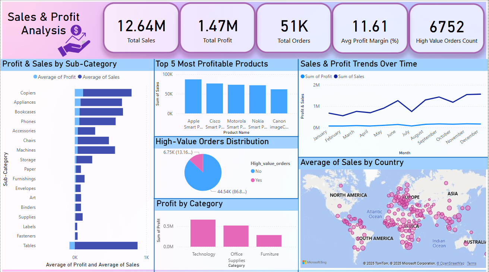
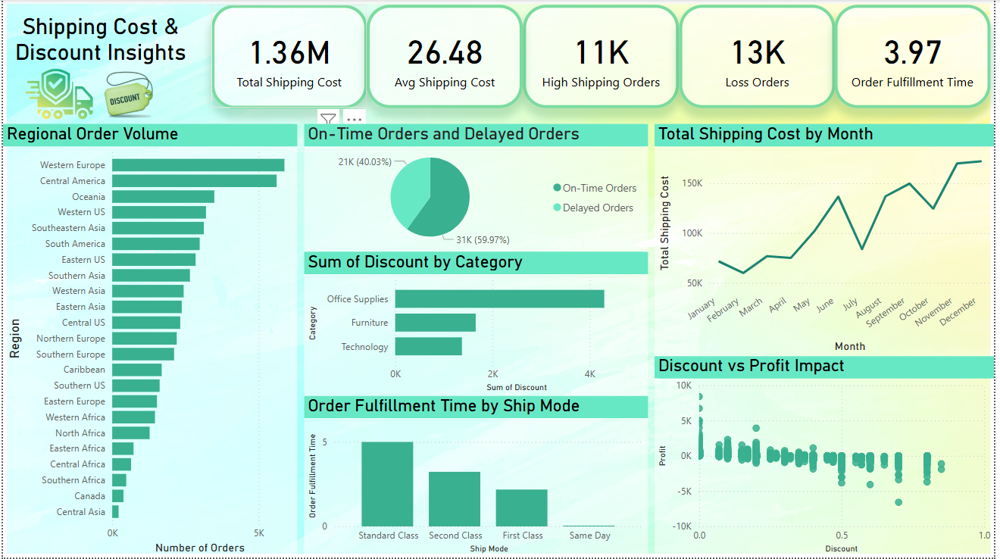
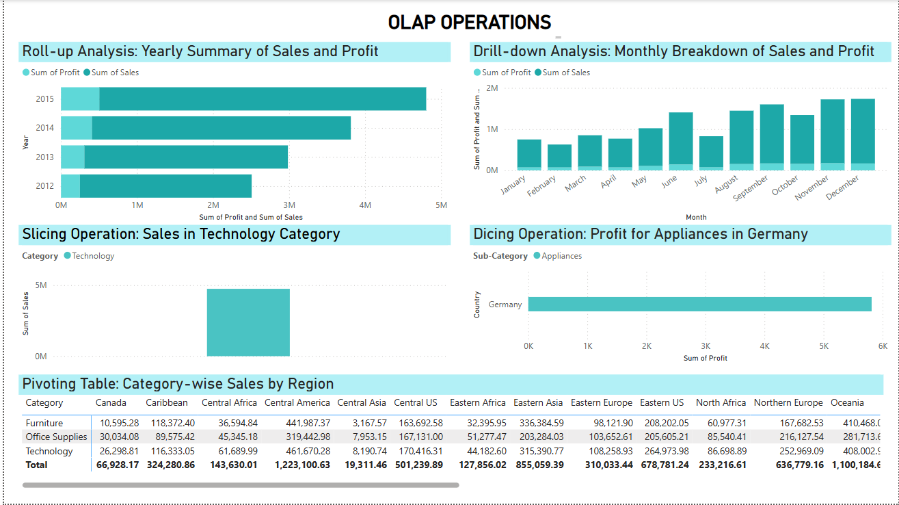

# Global Superstore Sales Data Analysis

## Project Overview

In today’s competitive business environment, data-driven decision-making is essential for optimizing sales performance and operational efficiency. This project presents a comprehensive analysis of **Global Superstore Sales Data**, focusing on data preprocessing, Power BI visualization, statistical hypothesis testing, and actionable business insights.

## Author

**Numaira Zaib**

## Objective

The primary goal of this project is to:
- Explore large-scale retail sales data
- Identify key sales trends and performance indicators
- Conduct hypothesis testing for data-driven insights
- Provide strategic business recommendations

## Tools & Technologies Used

- **Power BI** – Interactive dashboards and visualizations
- **Power Query Editor** – Initial data cleaning and exploration
- **Python / Jupyter Notebook** – For hypothesis testing and preprocessing
- **Statistical Analysis** – Hypothesis testing and correlation analysis

## Dashboards

